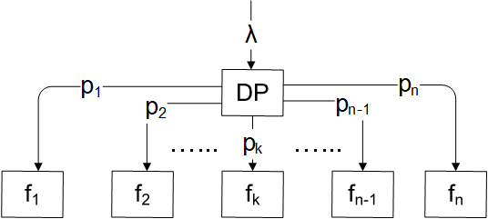

# Function-as-a-service Simulator (FaasSim)

FaasSim is an event-driven simulator for a FaaS platform. It simulates the platform with  number of functions. Since it is not suggested as a <a href="https://www.ibm.com/cloud/learn/faas#toc-principles-JNV0JBYp">best practice</a>, the simulator doesn't consider a function calling another function. The architecture of FaasSim is as follows: 

FaasSim follows an open workload model. The requests arrive following a Poisson process at a rate . The functions are ordered in terms of their popularity. That is, the first function has the most and the  function has the least probability of being called for service. To introduce this popularity among the functions, we have used the <a href="https://en.wikipedia.org/wiki/Zipf%27s_law">Zipf parameter</a>. Each function has its own service times, cold start times, idle times and memory consumption values. There are two different memory consumption values - one while the function is idle and other when it is in-execution.  A sample set of parameters is provided in the experiment folder.

To run the simulator first compile the code:

    javac *.java

Next run the code as follows:

    java -Xms6144m -Xmx8192m FaasSim 64 0.5 0.6 cocoa 2 1 5

We need to pass the VM arguments (Xms and Xmx) to allocate the required amount of memory. The values are high as by default FaasSim collects large number of samples (107) and stores different traces corresponding to these samples in the memory to make the simulation faster.

The arguments for the main program are: <i>numberOfFunctions arrivalRate zipfShape expectedHitRate numberOfCpus iterationStartIndex iterationEndIndex</i>

    

FaasSim looks for the service times, cold start times, idle times and the memory consumption values in the folder corresponding to the arguments passed. For the above run command, it will look for the service times, cold start times and memory consumption values in the folder <i>experiment/params/64/0.5/0.6</i>. And for the idle times it will look at the folder <i>experiment/params/64/0.5/0.6/idleTimes/cocoa</i>.

The outputs are provided in the <i>experiment</i> folder. It creates four result folders inside the epxeriment folder. These are <i>cpu</i>, <i>logs</i>, <i>mem</i>, <i>response</i>. Inside each of those folders, a folder is created corresponding to the arguments passed like <i>64/0.5/0.6/cocoa</i>. Inside this folder, there can be multiple folders depending on the number iterations. 

The <i>cpu</i> folder contains the CPU utilization value. The cold start probabilities of each function can be calculated from the files in <i>logs</i> folder. The memory consumption values for the simulation period are provided in the <i>mem</i> folder. FaasSim provides two types memory of value - first, the memory consumption considering the function idle and in-execution memory usage and second, the memory consumption if the platform follows a guaranteed memory reservation policy. Finally, the <i>response</i> folder contains the response time of each function.

We have provided 3 set of idle times in the experiment folder. The ones inside the <i>experiment/params/64/0.5/0.6/idleTimes/0.8</i> and <i>experiment/params/64/0.5/0.6/idleTimes/0.95</i> are estimated using an availability aware approach from TTL cache research. The one in <i>experiment/params/64/0.5/0.6/idleTimes/cocoa</i> is approximated by a novel method <a href="https://arxiv.org/pdf/2007.01222.pdf">COCOA</a>. For the considered arguments, these idle times from COCOA can ensure that the response time of the functions will remain below <b>2 seconds</b> with only <b>2 CPUs</b>.

